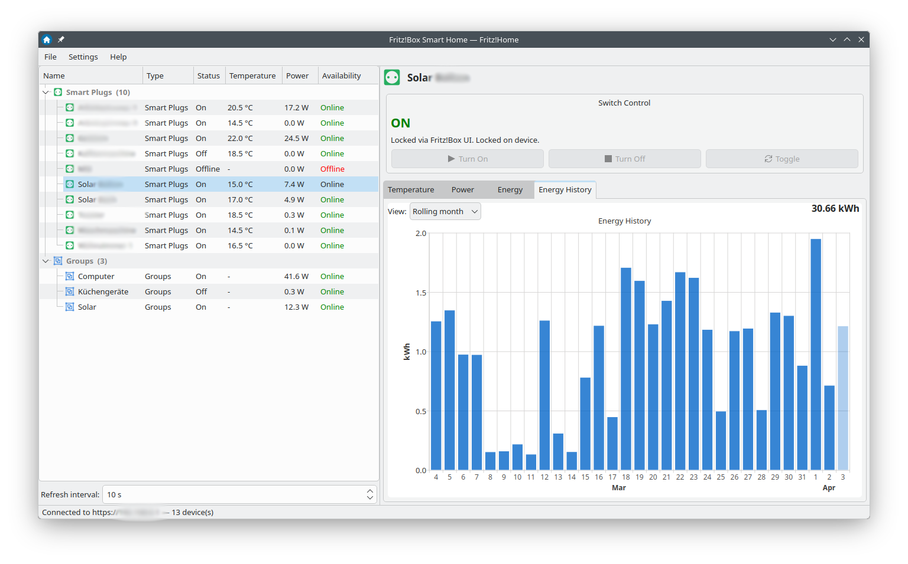
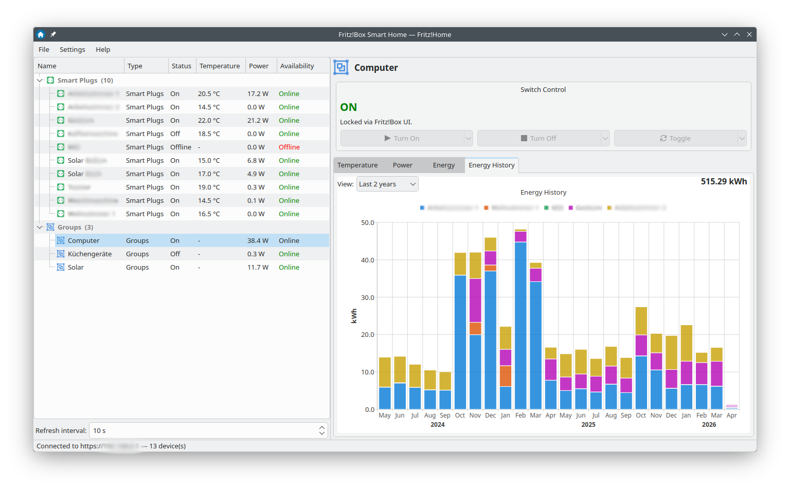
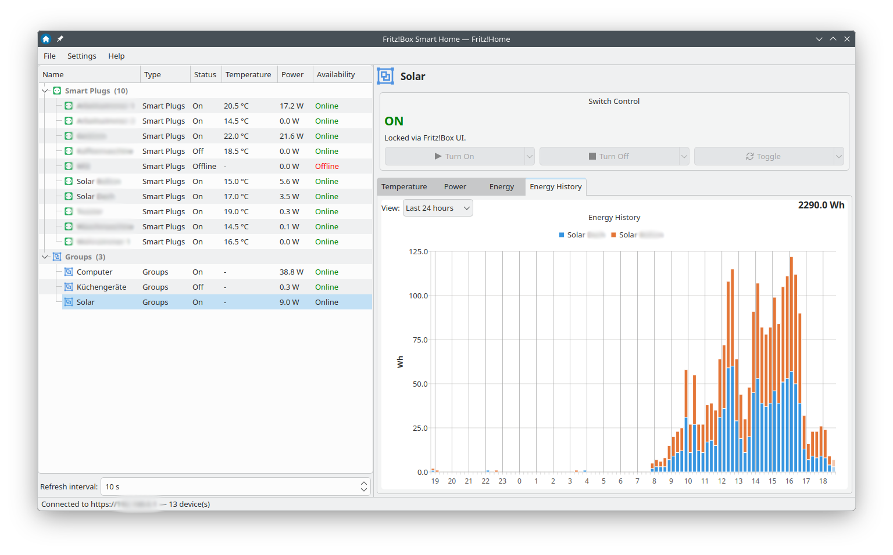

# Fritz!Home

**Fritz!Home** is a **Qt desktop application** for monitoring and controlling **AVM Fritz!Box Smart Home** devices. Built with Qt (5 or 6), it optionally integrates with KDE Frameworks — using KWallet for secure credential storage and KI18n for localisation — but runs equally well on any Linux desktop without KDE.

Communicates directly with the Fritz!Box router over the local network using the Fritz!Box [Smart Home REST API](https://avm.de/service/schnittstellen/) — no cloud, no account, no internet required.

---

## Features

- **Real-time device dashboard** with a two-panel split view: grouped device tree on the left, live control panel and charts on the right
- **Controls all Fritz!DECT and Fritz!Smart Home device types:**

  | Device type | Controls |
  |---|---|
  | Smart plugs / switchable outlets | On / Off / Toggle, lock status |
  | Radiator controllers (HKR) | Target temperature, comfort/eco modes, battery & window-open status |
  | Energy meters | Live power (W), total energy (Wh), voltage (V) |
  | Dimmers / dimmable bulbs | Level slider + percentage, On/Off |
  | RGBW colour bulbs | Hue/saturation sliders, colour-temperature mode, live colour swatch |
  | Roller blinds / jalousies | Open / Close / Stop |
  | Humidity sensors | Relative humidity % |
  | Door/window alarm sensors | Triggered state, last alert timestamp |
  | Fritz!Box device groups | Grouped display in tree; stacked per-member power chart; multi-line per-member temperature chart; per-member energy pie chart |

- **Live charts** (Temperature, Power, Humidity, Energy gauge, Energy history with configurable resolution; bar chart shows hover tooltips with date/value, and the most recent bar is visually dimmed to indicate an incomplete accumulation period; group devices show a **stacked energy history bar chart** with one colour-coded bar segment per member device, a **stacked per-member power chart**, and a **multi-line temperature chart** with one line per temperature-capable member). For groups the Energy tab also shows a **per-member pie chart** summarising each member's share of total energy; slice labels show both absolute and percentage values, with overlap-aware visibility that hides labels of small neighbouring slices; hovering a slice explodes it and shows a tooltip with its details.
- **Configurable polling interval** (2 – 300 s), shown below the device tree
- **Automatic login** — optional checkbox in the Connect dialog; skips the dialog on next launch if stored credentials are available
- **Secure password storage** via KWallet (KDE) or libsecret/GNOME keyring
- **Persistent UI state** — window geometry, splitter and column widths, chart slider position, and zoom level survive restarts
- **CLI flags** for unattended / scripted startup (`--host`, `--username`, `--password`, `--interval`)
- **German (de) translation** included — KF builds use KI18n `.po`/`.mo`; no-KF builds use a compiled `.qm` resource

---

## Screenshots

**Single device — energy history (Rolling Month)**



**Group device — stacked energy history (Last 2 Years)**



**Group device — stacked energy history (Last 24 Hours)**



---

## Fritz!Box user recommendation

For security, create a **dedicated Fritz!Box user** for Fritz!Home with **Smart Home permissions only** — do not use the Fritz!Box admin password.

1. Open your Fritz!Box web interface at `http://fritz.box` and log in as admin.
2. Go to **System → Fritz!Box Users → Add User**.
3. Set a username (e.g. `smarthome`) and a strong password.
4. Under **Permissions**, enable **Smart Home** only — leave all other permissions (especially remote access and NAS) disabled.
5. Click **OK** and use these credentials in the Fritz!Home connect dialog.

This limits the blast radius if the credentials are ever compromised: a Smart Home-only account cannot change router settings, access files, or open remote connections.

---

## Requirements

| Requirement | Leap 15.6 build | Leap 16.0 build | Tumbleweed build | Tumbleweed aarch64 build | Ubuntu 24.04 build |
|---|---|---|---|---|---|
| Qt | Qt 5 (≥ 5.15) | Qt 6 (≥ 6.5) | Qt 6 (latest) | Qt 6 (latest, cross-compiled) | Qt 6 (≥ 6.5) |
| KDE Frameworks | None (optional: KF5 via OBS) | KF6 via KDE:Extra OBS repo | KF6 (standard repo) | KF6 (ports mirror sysroot) | None (libsecret) |
| Secure storage | libsecret (freedesktop Secret Service) | KWallet (KF6) | KWallet (KF6) | KWallet (KF6) | libsecret |
| Compiler | GCC with C++17 | GCC with C++17 | GCC with C++17 | cross-aarch64-gcc14 (C++17) | GCC with C++17 |
| Build tools | CMake ≥ 3.20, Ninja | CMake ≥ 3.20, Ninja | CMake ≥ 3.20, Ninja | CMake ≥ 3.20, Ninja | CMake ≥ 3.20, Ninja |
| Fritz!Box | Any model with Smart Home / Fritz!DECT support | same | same | same | same |

---

## Building

### With Docker (recommended)

Docker build images are provided for each supported distribution. No local Qt or KDE packages are required on the host — only Docker.

```bash
# Build for all distros (Release, default)
./docker/build.sh --distro all

# Build for a specific distro (Release, default)
./docker/build.sh --distro opensuse-leap-15.6-x86_64
./docker/build.sh --distro opensuse-leap-16.0-x86_64
./docker/build.sh --distro opensuse-tumbleweed-x86_64
./docker/build.sh --distro opensuse-tumbleweed-aarch64
./docker/build.sh --distro ubuntu-24.04-x86_64

# Build with Debug symbols and qDebug output enabled
./docker/build.sh --distro opensuse-tumbleweed-x86_64 --build-type Debug
./docker/build.sh --distro ubuntu-24.04-x86_64 --build-type Debug
```

**Build type options** (default: `Release`):
- `Release` — Optimized build, suitable for deployment. Disables debug output and assertions.
- `Debug` — Includes debug symbols and enables `qDebug()` output (useful for troubleshooting). Binaries are larger and slower but provide detailed runtime logging.

The resulting binaries and packages are placed in a hierarchical directory tree under `out/`:

```
out/
├── opensuse/
│   ├── leap15.6/x86_64/
│   │   ├── fritzhome
│   │   └── fritzhome-1.0.0-1.x86_64.rpm
│   ├── leap16.0/x86_64/
│   │   ├── fritzhome
│   │   └── fritzhome-1.0.0-1.x86_64.rpm
│   └── tumbleweed/
│       ├── x86_64/
│       │   ├── fritzhome
│       │   └── fritzhome-1.0.0-1.x86_64.rpm
│       └── aarch64/
│           ├── fritzhome                        (ELF aarch64 binary, cross-compiled)
│           └── fritzhome-1.0.0-1.aarch64.rpm
└── ubuntu/
    └── 24.04/amd64/
        ├── fritzhome
        └── fritzhome_1.0.0-1_amd64.deb
```

Package filenames follow distribution conventions (RPM: `name-version-release.arch.rpm`; DEB: `name_version-release_arch.deb`). The directory path encodes the distro family, release, and architecture.

### Manual build (no Docker)

```bash
# openSUSE Leap 15.6 — Qt5 only, no KDE Frameworks (Release)
cmake -B build -G Ninja -DCMAKE_BUILD_TYPE=Release -DUSE_KF=0
ninja -C build

# With KDE Frameworks 5 (requires KDE:Frameworks5 OBS repo on Leap 15.6)
cmake -B build -G Ninja -DCMAKE_BUILD_TYPE=Release -DUSE_KF=5
ninja -C build

# With KDE Frameworks 6 (requires KDE:Extra OBS repo on Leap 16.0)
cmake -B build -G Ninja -DCMAKE_BUILD_TYPE=Release -DUSE_KF=6
ninja -C build

# Debug build (with symbols and qDebug output)
cmake -B build -G Ninja -DCMAKE_BUILD_TYPE=Debug -DUSE_KF=6
ninja -C build
```

**`USE_KF` values:**

| Value | Qt | KDE Frameworks | Password backend |
|---|---|---|---|
| `0` | Qt 5 | None | libsecret or QSettings |
| `5` | Qt 5 | KF5 | KWallet |
| `6` | Qt 6 | KF6 | KWallet |
| `qt6` | Qt 6 | None | libsecret or QSettings |
| *(empty)* | auto | auto-detect | auto |

---

## Running

```
fritzhome [options]

Options:
  -H, --host <host>          Fritz!Box hostname or IP  (default: fritz.box)
  -u, --username <user>      Fritz!Box username
  -p, --password <password>  Password  (skips login dialog on startup)
  -i, --interval <seconds>   Polling interval in seconds  (default: 10, range 2–300)
```

Without `--password`, a login dialog is shown at startup. Credentials are stored securely in the system keyring (KWallet or GNOME/KDE Secret Service) and pre-filled on subsequent launches. The dialog also provides an **"Ignore TLS certificate warnings"** checkbox for Fritz!Box installations that use a self-signed HTTPS certificate.

---

## Project structure

```
src/
├── main.cpp                    Entry point, CLI parsing, QApplication / KApplication init, QTranslator setup
├── fritzdevice.h               All device data structs (FritzDevice, stats sub-structs, FunctionMask)
├── fritzapi.{h,cpp}            REST API client — login (pbkdf2/md5), polling, all set-commands, JSON parsing
├── mainwindow.{h,cpp}          Top-level window, device tree, panel switching
├── loginwindow.{h,cpp}         Connection-settings dialog (host, username, password, ignore-TLS option)
├── devicemodel.{h,cpp}         QAbstractItemModel for the two-level grouped device tree
├── devicewidget.{h,cpp}        Abstract base class for control panels
├── switchwidget.{h,cpp}        Smart plug / switch panel
├── thermostatwidget.{h,cpp}    Radiator controller panel
├── energywidget.{h,cpp}        Energy meter panel
├── dimmerwidget.{h,cpp}        Dimmer / dimmable-bulb panel
├── blindwidget.{h,cpp}         Roller blind panel
├── colorwidget.{h,cpp}         RGBW colour-bulb panel
├── humiditysensorwidget.{h,cpp} Humidity sensor panel
├── alarmwidget.{h,cpp}         Alarm sensor panel
├── chartwidget.{h,cpp}         Live charts (Qt Charts) — temperature, power, humidity, energy
├── secretstore.{h,cpp}         Cross-backend password storage (KWallet / libsecret / QSettings)
└── i18n_shim.h                 i18n shim — KLocalizedString (HAVE_KF=1) or QCoreApplication::translate (HAVE_KF=0)

po/
└── de/fritzhome.po             German .po catalogue (KF build; installed as .mo by ki18n_install)

translations/
└── fritzhome_de.ts             German Qt translation source (no-KF build; compiled to .qm resource)
```

---

## Password security

Passwords are **never** written to disk in plaintext. The backend is chosen at compile time based on available libraries:

1. **KWallet** — when built with KDE Frameworks (`USE_KF=5` or `USE_KF=6`). Encrypted wallet, integrates with KDE session unlock.
2. **libsecret / Secret Service** — when KF is absent but `libsecret-1` is available (standard Leap 15.6 OSS repo). Works with GNOME Keyring and KDE Wallet in Secret Service mode.
3. **QSettings** (plaintext fallback) — only if neither of the above is available. A warning is printed to the build log. Not recommended for production use.

---

## License

GNU General Public License v3.0 — see [LICENSE.txt](LICENSE.txt) or [gnu.org/licenses/gpl-3.0](https://www.gnu.org/licenses/gpl-3.0.html).

© 2026 Ulf Saran — [https://github.com/flunaras/fritzhome](https://github.com/flunaras/fritzhome)
